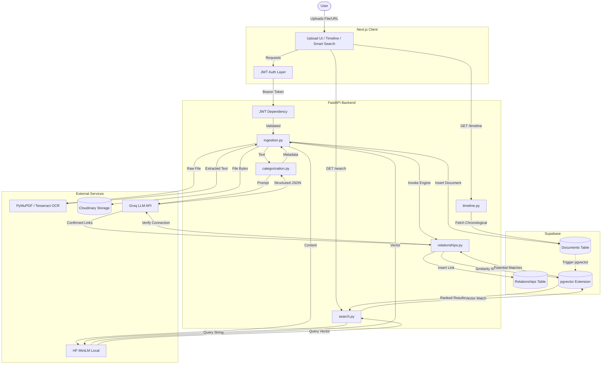

# Architecture Overview

## Data Flow Diagram

## Step-by-Step Flow

When a user interacts with the application, their request is routed through a modern decoupled pipeline:

1. **Authentication:** All requests from the Next.js client hit the JWT Auth layer first. The FastAPI backend validates this token globally to ensure endpoints are gated and user data remains isolated.
2. **Ingestion & Extraction (`ingestion.py`):** When a file or URL is uploaded, `ingestion.py` acts as the orchestrator. It immediately routes files through `PyMuPDF` or `Tesseract OCR` to extract raw text, whilst simultaneously uploading the source asset to **Cloudinary** for permanent cloud storage.
3. **Categorization & Structuring (`categorization.py`):** The raw, unstructured text is passed to `categorization.py`, which formats a strict prompt and sends it to **Groq**. Groq returns a structured JSON object containing a clean summary, title, inferred date, and document category.
4. **Vector Embeddings:** Before hitting the database, the categorized text is run through a local HuggingFace `sentence-transformer` model (`all-MiniLM-L6-v2`) to generate a highly dimensional semantic embedding vector.
5. **Relationship Engine (`relationships.py`):** Once the document is safely stored in **Supabase**, `relationships.py` is invoked. It performs a semantic similarity search across the user's existing documents using `pgvector`. It then feeds these potential matches to Groq for a final logical verification. If Groq confirms the documents are meaningfully related, a link is saved in the relationships table.
6. **Retrieval (`timeline.py` & `search.py`):** The Next.js frontend fetches processed data via `timeline.py` (which sorts documents chronologically) and `search.py` (which re-embeds the user's search query and performs a raw cosine-similarity match against the vector database).

## Why These Choices?

- **Supabase + pgvector (vs. separate vector database):** Using Supabase allows us to combine standard relational data (document metadata, user IDs) alongside vector embeddings in a single PostgreSQL database. This eliminates the need to synchronize data between a primary database and a secondary vector database like Pinecone or Milvus, vastly simplifying the architecture.
- **Groq (vs. OpenAI/Anthropic):** Groq's Llama-3 endpoints offer unprecedented token-generation speeds. Because our ingestion pipeline heavily relies on LLMs for both initial JSON categorization and secondary relationship verification, using Groq prevents the upload endpoint from timing out and drastically improves user experience.
- **Local Embeddings (MiniLM) (vs. API embeddings):** We generate embeddings locally using the HuggingFace `sentence-transformers` library. While API-based embeddings (like OpenAI's `text-embedding-3`) offer slightly higher dimensionality, running MiniLM locally is completely free, avoids network latency during the heavy ingestion phase, and provides "good enough" semantic mapping for the scale of personal document archiving.
