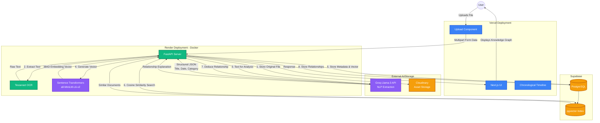

# MemoryVerse AI - Architecture & Workflow

You can view this diagram by pasting the code below into [Mermaid Live Editor](https://mermaid.live).

```mermaid
graph TD
    %% Styling
    classDef frontend fill:#3b82f6,stroke:#1d4ed8,stroke-width:2px,color:white;
    classDef backend fill:#10b981,stroke:#047857,stroke-width:2px,color:white;
    classDef ai fill:#8b5cf6,stroke:#6d28d9,stroke-width:2px,color:white;
    classDef database fill:#f59e0b,stroke:#b45309,stroke-width:2px,color:white;
    
    %% Components
    User((User))
    
    subgraph Frontend [Vercel Deployment]
        NextJS[Next.js UI]:::frontend
        UploadUI[Upload Component]:::frontend
        Timeline[Chronological Timeline]:::frontend
    end
    
    subgraph Backend [Render Deployment - Docker]
        FastAPI[FastAPI Server]:::backend
        OCR[Tesseract OCR]:::backend
        EmbeddingEngine[Sentence Transformers \n all-MiniLM-L6-v2]:::ai
    end
    
    subgraph AI_Services [External AI/Storage]
        Groq[Groq Llama-3 API \n NLP Extraction]:::ai
        Cloudinary[Cloudinary \n Asset Storage]:::database
    end
    
    subgraph Database [Supabase]
        Postgres[(PostgreSQL)]:::database
        PGVector[(pgvector Index)]:::database
    end

    %% Workflow Connections
    User -->|Uploads File| UploadUI
    UploadUI -->|Multipart Form Data| FastAPI
    
    FastAPI -->|1. Store Original File| Cloudinary
    FastAPI -->|2. Extract Text| OCR
    OCR -->|Raw Text| FastAPI
    
    FastAPI -->|3. Text for Analysis| Groq
    Groq -->|Structured JSON \n Title, Date, Category| FastAPI
    
    FastAPI -->|4. Generate Vector| EmbeddingEngine
    EmbeddingEngine -->|384D Embedding Vector| FastAPI
    
    FastAPI -->|5. Store Metadata & Vector| Postgres
    Postgres --> PGVector
    
    FastAPI -->|6. Cosine Similarity Search| PGVector
    PGVector -->|Similar Documents| FastAPI
    
    FastAPI -->|7. Deduce Relationship| Groq
    Groq -->|Relationship Explanation| FastAPI
    
    FastAPI -->|8. Store Relationships| Postgres
    
    FastAPI -->|Response| NextJS
    NextJS -->|Displays Knowledge Graph| User
```
